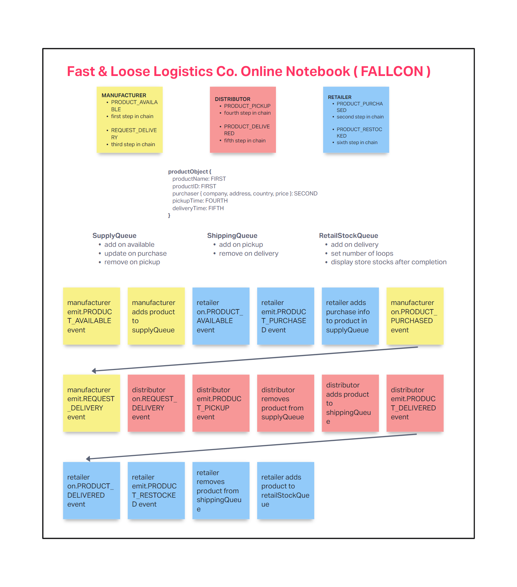

# LAB - Class 14

## Project: FALLCON

### Author: Adrienne Frey, Rafael Aldana Sandoval, Brandon Perard, Ken Holt

### Problem Domain  

Fast & Loose Logistics Co. is transitioning their tracking system from a literal notebook of their client interactions to a modern digital system. The "Fast & Loose Logistics Co. Online Notebook" (aka FALLCON) is the result of this endeavour.

FALLCON (cue thunderous & triumphant bird scream) is a real-time system that allows products to be tracked throughout the entire distribution process, combining the reliability of Fast & Loose Logistics Co. with the instant gratification of modern technology.

The server provides the routing of communication between the manufacturer, distributor, and supplier, while also maintaining product tracking throughout the process. The clients provider a means for each entity in the cycle to communicate the events in real-time, and update the product information & inventory.

### Links and Resources

- [GitHub Actions ci/cd](https://github.com/bperard/fallcon/actions)
<!-- - [back-end server url](http://xyz.com) (when applicable)
- [front-end application](http://xyz.com) (when applicable) -->

### Setup

#### `.env` requirements (where applicable)

PORT=designates port Socket.IO server uses

#### How to initialize/run your application (where applicable)

- npm i to install dependencies
- node index for each server and each client

#### How to use your library (where applicable)

#### Features / Routes

- Socket.IO server with queue functionality
- Clients for manufacturer, distributor, and retailer to handle socket events

#### Tests

- Client handler functions
- Server lib classes

#### UML

